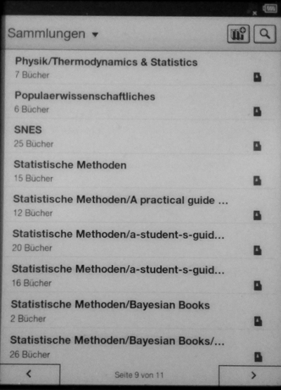
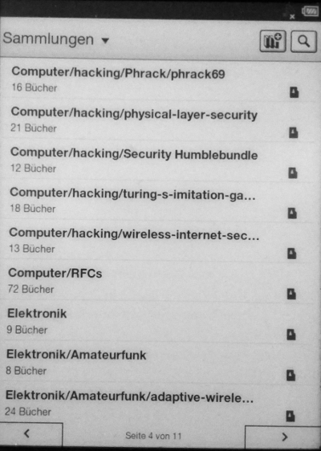

# Scripts for Sony PRS-T2 Ebook Reader

## collection_generator.py

Display and manipulate the SQlite databases on the Sony PRS-T2 Ebook
Reader.  Maybe this script works also for other Sony Ebook Readers,
but the author does not have access to any and cannot test that. You
are welcome to let me know if it does for you.

This script generates "collections" on the ebook reader according to
the folder structure below the books/ folder.
See the `./collection_generator.py --help` message for more details.

### Example

Say, the folder structure on your Reader
below `/media/sonyprst2/Sony_Reader/media/books` is

```
.
  |-Physik
  |  |-Thermodynamics & Statistics
  |-Populaerwissenschaftliches
  |-SNES
  |-Statistische Methoden
  |  |-a-student-s-guide-to-data-and-error-analysis
  |  |-a-student-s-guide-to-dimensional-analysis
  |  |-Bayesian Books
  |  |  |-Bayesian econometric methods
  |  |  |-computer-age-statistical-inference
  |  |-A practical guide to scientific data analysis
  |-Computer
  |  |-hacking
  |  |  |-Security Humblebundle
  |  |  |-Phrack
  |  |  |  |-phrack69
  |  |  |-physical-layer-security
  |  |  |-turing-s-imitation-game
  |  |  |-wireless-internet-security
  |  |-RFCs
  |-Elektronik
  |  |-Amateurfunk
  |  |  |-adaptive-wireless-communications
  |  |  |-analysis-and-modeling-of-radio-wave-propagation
```

then this script will allow to quickly generate collections like
this. Note that depth can be arbitrary but the number of characters
displayed is limited.




### how to use it

 1. Connect the reader to your computer, using usb.
 2. Touch the "yes I want to connect to a PC" button on the screen of the reader.
 3. Mount it. On my linux system, I just need to click on the device icons in the file manager.

If you insert an SD card into the reader, you have two places to store
books, the internal memory and the SD card. It seems to me they are
equivalent, and they have independent databases.  *Since I just store
all ebooks on the SD card, I do not know anything about a mixed usage,
i.e. how things behave if ones puts some files on the internal memory.*

Let's assume your reader's storage (or the SD card) is mounted to /media/sonyprst2/ .

 4. Copy your ebook files onto the reader.  I put my files somewhere
 below /media/sonyprst2/Sony_Reader/media/books/
 5. **Unmount and disconnect** the reader.
 6. Wait for the reader to index all new files. While the PRS-T2 is working
 to index the new files, you'll see the rotating arrow symbol in the topleft corner.
 7. When indexing has finished, connect the reader to the computer again and mount.
 8. Execute the collection_generator.py script. Typically like this:

        ./collection_generator.py --delete-collections --generate-collections /media/sonyprst2

    This first deletes all existing collections and then generates new
    collections, based on the folder structure below
    /media/sonyprst2/Sony_media/media/books

 9. Unmount the reader.

## download_rfcs.sh

This only downloads a list of RFCs from their official location at ietf.org, using wget.
